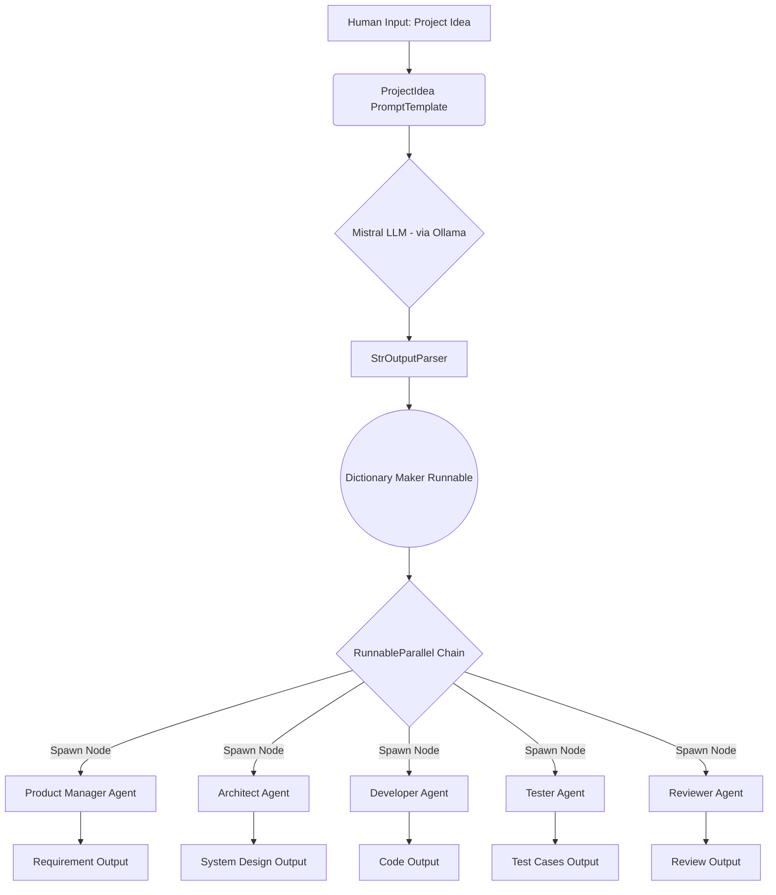

# 🚀 Multi-Agent AI Software Development Team

Welcome to the **Multi-Agent AI Software Development Team** pipeline! This document contains a ready-to-use professional LinkedIn post to showcase your project to recruiters and the community, as well as a technical breakdown of the platform.

---

## 📱 LinkedIn Post Draft

**Looking to revolutionize the Software Development Life Cycle (SDLC) using AI?** 🤖✨

I just built a **Multi-Agent AI Software Development Team** pipeline using LangChain and Mistral! This project attempts to automate the core phases of software development by splitting tasks intelligently across specialized AI agents. 

Instead of a single LLM trying to do everything, I orchestrated an interconnected "digital team" where every aspect of development is handled by a specialized persona.

Here's how my AI team is structured:
1️⃣ **The Product Manager** 📊 - Translates the initial idea into strict requirements, feature lists, API endpoints, and constraints.
2️⃣ **The Architect** 🏗️ - Designs the system structure, folder layout, tech stack decisions, and DB schema.
3️⃣ **The Developer** 💻 - Writes the actual code with rich syntax and robust examples.
4️⃣ **The Tester** 🧪 - Generates comprehensive test cases to ensure reliability and edge-case coverage.
5️⃣ **The Reviewer** 🧐 - Audits the entire workflow and code for security, performance, and best practices.

### 🛠️ Tech Stack & Technologies Used:
*   **LangChain / LangChain Core:** Orchestrates the complex routing, custom PromptTemplates, and parsing.
*   **Ollama (Mistral):** Powers the local inference engine—keeping everything snappy, cost-effective, and fully private!
*   **Pipeline Architecture:** Utilized `RunnableParallel` and `RunnableLambda` to run the Developer, Architect, Tester, and Reviewer logic *concurrently* to drastically speed up processing times.
*   **Python:** The glue holding it all together in an interactive Jupyter environment.

Building this taught me a massive amount about advanced LLM orchestration, parallel execution in LangChain chains, and prompt engineering for strict structured outputs. 

Check out the visual architecture of the pipeline below! I'd love to hear your thoughts—what role would you add to this AI team? 👇 

#AI #LangChain #MachineLearning #GenerativeAI #Python #SoftwareEngineering #TechInnovation #Ollama #Mistral

---

## 🎨 Generated Project Banner

*(You can download the image above and use it as the header image for your LinkedIn post or GitHub README!)*

---

## ⚙️ The Pipeline Architecture

Here is the visual representation of how the LangChain components process and route data under the hood.

### 🧠 How It Works:
1. **The Seed**: A human provides a simple text idea for a project (e.g., "Build a battery monitor app").
2. **Initial Structure**: The `ProjectIdea` prompt forces the LLM to act as a system planner, dividing the task into 5 specific zones and outputting a highly structured text blob.
3. **Parsing**: LangChain's `StrOutputParser` extracts the raw string, and a custom `dictionary_maker_runnable` formats it uniformly so it can be passed down the chain.
4. **Parallel Execution (`RunnableParallel`)**: The standardized text is sent to 5 completely independent AI agents simultaneously. Each agent (wrapped in a `RunnableLambda`) has its own custom system prompt instructing it to extract only what it needs from the context and expand upon it!
